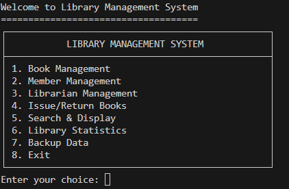
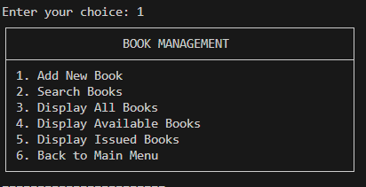

# 📚 Library Management System

[](https://www.oracle.com/java/)
[]()
[]()
[]()

A comprehensive **Library Management System** built using Object-Oriented Programming principles in Java. This project demonstrates **classes, inheritance, polymorphism, encapsulation, and file handling** for managing books, members, and library operations.

## 🎯 Project Overview

This Library Management System showcases core OOP concepts through a practical application that handles:
- **Book Management**: Add, search, issue, and return books
- **Member Management**: Register members with different membership types
- **Librarian Management**: Staff management with administrative privileges
- **File Persistence**: Data storage using file handling techniques
- **Inheritance Hierarchy**: Person → Member/Librarian classes
- **Polymorphism**: Method overriding and abstract classes

## 🔧 OOP Concepts Demonstrated

### 1. **Classes and Objects**
- `Book`: Represents library books with properties and methods
- `Person`: Abstract base class for all library users
- `Member`: Library members who can borrow books
- `Librarian`: Staff with administrative privileges
- `Library`: Main business logic class
- `FileHandler`: Utility class for data persistence

### 2. **Inheritance**
```java
Person (Abstract Base Class)
├── Member (extends Person)
└── Librarian (extends Person)
```

### 3. **Encapsulation**
- Private fields with public getter/setter methods
- Data validation and business logic encapsulation
- Protected access for inheritance

### 4. **Polymorphism**
- Abstract methods in `Person` class
- Method overriding in subclasses
- Interface-like behavior through abstract methods

### 5. **File Handling**
- Reading/writing data to text files
- CSV-format data storage
- Backup and restore functionality
- Error handling for file operations

## 📸 Screenshots

### Main Menu


### Book Management



## 🚀 Features

### 📖 Book Management
- ✅ Add new books to the library
- ✅ Search books by title, author, category, or ID
- ✅ View available and issued books
- ✅ Track book status (available/issued)
- ✅ Detailed book information display

### 👥 Member Management
- ✅ Register new members with different types:
  - **Regular**: 3 books maximum
  - **Premium**: 10 books maximum  
  - **Student**: 5 books maximum
- ✅ View member information and issued books
- ✅ Track membership dates and types

### 👨‍💼 Librarian Management
- ✅ Add librarian profiles with employee details
- ✅ Department and salary management
- ✅ Administrative privileges for book operations

### 🔄 Issue/Return System
- ✅ Issue books to members with date tracking
- ✅ Return books with validation
- ✅ Automatic due date calculation (14 days)
- ✅ Member book limit enforcement
- ✅ Book availability checking

### 💾 Data Persistence
- ✅ File-based storage (no database required)
- ✅ Automatic data loading on startup
- ✅ Data backup functionality
- ✅ CSV format for easy data inspection

### 📊 Reports and Statistics
- ✅ Library statistics dashboard with table format
- ✅ Books by category breakdown
- ✅ Members by type analysis
- ✅ Available vs issued books tracking

### 🎨 User Interface
- ✅ Professional table-based console interface
- ✅ Unicode box-drawing characters for clean borders
- ✅ Auto-adjusting column widths
- ✅ Consistent formatting across all menus and data displays

## 📁 Project Structure

```
LibraryManagementSystem/
├── src/
│   ├── Book.java                    # Book class with properties and methods
│   ├── Person.java                  # Abstract base class for inheritance
│   ├── Member.java                  # Member class extending Person
│   ├── Librarian.java              # Librarian class extending Person
│   ├── Library.java                # Main business logic class
│   ├── FileHandler.java            # File operations utility class
│   └── LibraryManagementApp.java   # Main application with menu system
├── data/                           # Data storage directory (auto-created)
│   ├── books.txt                   # Books data file
│   ├── members.txt                 # Members data file
│   └── librarians.txt              # Librarians data file
├── build/                          # Compiled class files (auto-created)
├── docs/                           # Documentation directory
├── compile_and_run.bat            # Windows compilation script
├── run.bat                        # Windows quick run script
└── README.md                      # This documentation
```

## 🚀 Quick Start

### Prerequisites
- **Java JDK 8 or higher** installed
- Command prompt or terminal access
- Windows OS (for batch files) or any OS with Java

### Method 1: Using Batch Files (Windows)
```bash
# Clone or download the project
cd LibraryManagementSystem

# Compile and run (first time)
.\compile_and_run.bat

# Quick run (subsequent times)
.\run.bat
```

### Method 2: Manual Compilation
```bash
# Navigate to project directory
cd LibraryManagementSystem

# Create build directory
mkdir build

# Compile all Java files
javac -d build src/*.java

# Run the application
cd build
java LibraryManagementApp
```

### Method 3: Using IDE
1. Import the project into your Java IDE (IntelliJ IDEA, Eclipse, etc.)
2. Set the `src` folder as the source directory
3. Run the `LibraryManagementApp.java` file


## 🎮 How to Use

### 1. **First Launch**
- Application automatically creates sample data
- Sample books, members, and librarian are added
- Data files are created in the `data/` directory

### 2. **Main Menu Navigation**
```
┌──────────────────────────────────────────────────┐
│            LIBRARY MANAGEMENT SYSTEM             │
├──────────────────────────────────────────────────┤
│ 1. Book Management                               │
│ 2. Member Management                             │
│ 3. Librarian Management                          │
│ 4. Issue/Return Books                            │
│ 5. Search & Display                              │
│ 6. Library Statistics                            │
│ 7. Backup Data                                   │
│ 8. Exit                                          │
└──────────────────────────────────────────────────┘
```

### 3. **Sample Operations**

#### Issue a Book:
1. Select "Issue/Return Books" → "Issue Book to Member"
2. Enter Book ID: `B001`
3. Enter Member ID: `M001`
4. System automatically calculates return date (14 days)

#### Add New Member:
1. Select "Member Management" → "Add New Member"
2. Fill in member details
3. Choose membership type (Regular/Premium/Student)
4. Member is registered with appropriate book limits

#### Search Books:
1. Select "Search & Display" → "Search Books"
2. Enter search query (title, author, category, or ID)
3. View matching results

## 📊 Sample Data

### Default Books:
- **B001**: Java Programming by James Gosling
- **B002**: Data Structures by Robert Lafore
- **B003**: Clean Code by Robert Martin
- **B004**: Design Patterns by Gang of Four
- **B005**: Algorithms by Thomas Cormen

### Default Members:
- **M001**: John Doe (Regular - 3 books max)
- **M002**: Jane Smith (Premium - 10 books max)
- **M003**: Bob Johnson (Student - 5 books max)

### Default Librarian:
- **L001**: Alice Wilson (Main Library Department)

## 🔍 OOP Implementation Details

### Inheritance Hierarchy
```java
// Abstract base class
public abstract class Person {
    protected String id, name, email, phone, address;
    public abstract String getRole();
    public abstract void displayInfo();
    public abstract String toFileString();
}

// Concrete implementations
public class Member extends Person {
    private String membershipType;
    private List<String> issuedBooks;
    // Member-specific methods
}

public class Librarian extends Person {
    private String employeeId, department;
    private double salary;
    // Librarian-specific methods
}
```

### Encapsulation Example
```java
public class Book {
    private String bookId;        // Private fields
    private boolean isIssued;
    
    public String getBookId() {   // Public getter
        return bookId;
    }
    
    public boolean issueBook(String memberId, String issueDate, String returnDate) {
        if (!isIssued) {          // Business logic encapsulation
            this.isIssued = true;
            // ... more logic
            return true;
        }
        return false;
    }
}
```

### File Handling Implementation
```java
// Save data to file
public static boolean saveBooks(List<Book> books) {
    try (BufferedWriter writer = new BufferedWriter(new FileWriter(BOOKS_FILE))) {
        for (Book book : books) {
            writer.write(book.toFileString());
            writer.newLine();
        }
        return true;
    } catch (IOException e) {
        System.err.println("Error saving books: " + e.getMessage());
        return false;
    }
}
```

## 📈 Learning Outcomes

This project demonstrates:

### 🎯 **Core OOP Principles**
- **Encapsulation**: Data hiding and method encapsulation
- **Inheritance**: Code reuse through class hierarchy
- **Polymorphism**: Method overriding and abstract methods
- **Abstraction**: Abstract classes and interfaces

### 💾 **File Handling Skills**
- Reading and writing text files
- CSV data format handling
- Error handling for I/O operations
- Data persistence without databases

### 🏗️ **Software Design Patterns**
- Repository pattern (Library class)
- Factory pattern (object creation from file strings)
- Template method pattern (abstract Person class)

### 🔧 **Programming Best Practices**
- Input validation and error handling
- Clean code structure and documentation
- Separation of concerns
- User-friendly console interface

## 🚀 Future Enhancements

### 🌟 Potential Improvements
- [ ] **GUI Interface**: Swing or JavaFX implementation
- [ ] **Database Integration**: MySQL or SQLite support
- [ ] **Advanced Search**: Multiple criteria filtering
- [ ] **Fine Management**: Late return penalties
- [ ] **Email Notifications**: Due date reminders
- [ ] **Barcode Support**: Book scanning functionality
- [ ] **Reports Generation**: PDF export capabilities
- [ ] **Multi-library Support**: Branch management

### 🔧 Technical Improvements
- [ ] **Unit Testing**: JUnit test cases
- [ ] **Logging**: Log4j integration
- [ ] **Configuration**: Properties file support
- [ ] **Validation**: Input validation framework
- [ ] **Security**: User authentication system

## 🎓 Educational Value

### **Perfect for Learning:**
- **Java Fundamentals**: Classes, objects, methods
- **OOP Concepts**: Practical inheritance and polymorphism
- **File I/O**: Real-world file handling scenarios
- **Data Structures**: Lists, collections, and algorithms
- **Software Design**: Clean architecture principles
- **Problem Solving**: Real-world application development

### **Resume Keywords:**
- Object-Oriented Programming (OOP)
- Java Programming
- File Handling and I/O Operations
- Data Persistence
- Inheritance and Polymorphism
- Console Application Development
- CRUD Operations
- Software Design Patterns

## 🤝 Contributing

### How to Contribute
1. Fork the repository
2. Create a feature branch: `git checkout -b feature/amazing-feature`
3. Implement your changes with proper OOP principles
4. Add comments and documentation
5. Test thoroughly
6. Commit changes: `git commit -m 'Add amazing feature'`
7. Push to branch: `git push origin feature/amazing-feature`
8. Open a Pull Request

### Development Guidelines
- Follow Java naming conventions
- Maintain OOP principles
- Add JavaDoc comments for public methods
- Include error handling
- Update README for significant changes

## 📄 License

This project is open source and available under the [MIT License](LICENSE).

## 🙏 Acknowledgments

- **Java Documentation** for comprehensive language reference
- **Object-Oriented Programming Principles** for design guidance
- **File I/O Best Practices** for data persistence implementation
- **Console Application Design** for user interface patterns

---

<div align="center">

### 📚 **Perfect for Academic Projects and Portfolio!**

**Built with ❤️ using Pure Java and OOP Principles**

[📖 View Code](src/) • [🐛 Report Bug](issues) • [✨ Request Feature](issues)

</div>

---

**Project Type**: Educational/Academic  
**Difficulty Level**: Intermediate  
**Estimated Time**: 2-3 days  
**Learning Focus**: OOP, File Handling, Java Fundamentals
